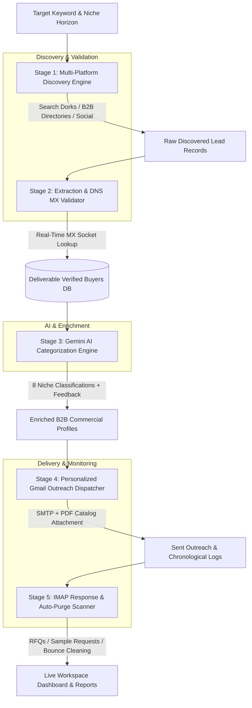

<div align="center">

# ExportFlow 🌐
### Autonomous B2B Export Outreach & Buyer Discovery Platform

[](https://python.org)
[](https://flask.palletsprojects.com)
[](https://react.dev)
[](https://vitejs.dev)
[](https://aistudio.google.com/)
[](https://mail.google.com)
[](https://opensource.org/licenses/MIT)

<p align="center">
  <b>Automating North American buyer discovery, DNS MX verification, AI categorization, personalized Gmail outreach, and live reply tracking for international export businesses.</b>
</p>

[Architecture](#architecture--pipeline-flow) •
[Features](#key-features) •
[Core Modules](#core-modules--pipeline-stages) •
[Quickstart](#getting-started) •
[API Reference](#api-reference)

</div>

---

## 📖 Overview

**ExportFlow** is a modern, full-stack autonomous B2B export outreach and lead intelligence platform built for international manufacturers, exporters, and B2B sourcing teams.

Unlike generic lead scrapers or cold email blasting tools, **ExportFlow**:
1. **Multi-Source Sourcing:** Relentlessly discovers qualified commercial buyers across the United States and Canada (home décor retailers, wedding & event stylists, luxury hotels, gift boutiques, interior design studios, party rental suppliers, and wholesale distributors).
2. **DNS MX Deliverability Guardrails:** Validates live DNS MX records directly against target mail exchangers before any email is queued, eliminating deliverability risks and protecting sender reputation.
3. **AI Classification & Insights:** Automatically classifies commercial buyer segments and writes tailored procurement feedback notes using **Google Gemini 2.5 Flash**.
4. **Personalized Dispatch with Dynamic Catalog Attachments:** Sends personalized Gmail SMTP campaigns with the official *Product Zone International (PZI)* Metal Candle Holder Export Specification PDF catalog (`Candle_Holders.pdf`).
5. **IMAP Reply Intelligence & Auto-Purging:** Continuously inspects connected mailboxes for inbound RFQs and sample inquiries, automatically detecting delivery bounce notices (*Address not found*) to purge bad records and blacklist invalid domains from employer reports.

---

## 🏗️ Architecture & Pipeline Flow

The **ExportFlow Pipeline** operates across five decoupled stages:



### Stage Details:
1. **Stage 1 — Multi-Platform Discovery Engine (`backend/modules/search_module.py`):**
   - Queries Bing, LinkedIn company directories, Instagram business profiles, Facebook trade hubs, and B2B registries (YellowPages Canada, ThomasNet, Manta).
   - Enforces domain deduplication against existing leads and blacklists to ensure every discovery session yields fresh buyers.
   - Connected with a 400+ verified North American buyer catalog fallback.

2. **Stage 2 — Extraction & DNS MX Validator (`backend/modules/extraction_module.py`, `validation_module.py`):**
   - High-precision regex extraction prioritizing direct procurement and buying contacts while rejecting platform bots and generic support emails.
   - Live socket-level DNS MX verification against Google Workspace, Microsoft 365, Proton, and cPanel servers.

3. **Stage 3 — Gemini AI Categorization (`backend/modules/classification_module.py`):**
   - High-throughput classification via `gemini-2.5-flash` sorting buyers across 8 distinct commercial sectors and generating tailored intern feedback notes.

4. **Stage 4 — Personalized Gmail Outreach Dispatcher (`backend/modules/gmail_module.py`, `presentation_module.py`):**
   - Multi-template email customization with dynamic variables (`{{company}}`, `{{product}}`, `{{signoff}}`).
   - Dynamic generation and MIME base64 packaging of the 2-page PZI Metal Candle Holder Export Catalog PDF.

5. **Stage 5 — Inbound Reply & Bounce Scanner (`backend/modules/inbox_module.py`):**
   - Secure SSL IMAP mailbox scanning detecting buyer sentiment (*sample requests, pricing inquiries, meeting bookings*).
   - Auto-purges delivery failure notices (DSNs) and suppresses failed contacts from active reports.

---

## ✨ Key Features

- **🛡️ Live DNS MX Validation**: Zero bounce tolerance. Validates mail server exchange capability before initiating outreach.
- **⚡ 8-Segment Commercial Classification**: Categorizes prospects into retailers, stylists, hotels, boutiques, design studios, party rentals, furniture chains, and wholesalers.
- **📄 Automated PDF Catalog Generation**: Built-in ReportLab generator attaching the official Product Zone International specification sheet.
- **📊 Standardized Employer Reporting**: Generates 7-column chronological reports formatted for seamless `Ctrl + V` TSV copying into Google Sheets/Excel.
- **📥 IMAP Gmail Response Intelligence**: Real-time detection of buyer replies, automated out-of-office return dates, and failed delivery notices.
- **🚫 Automated Blacklist & Exclusion Memory**: Permanently blacklists deleted leads and bad domains from future searches.

---

## 🗂️ Repository Structure

```
Export_Flow/
├── backend/
│   ├── app.py                      # Flask REST API & module orchestration
│   ├── requirements.txt            # Python dependencies
│   ├── .env.example                # Backend environment variable template
│   ├── assets/
│   │   └── Candle_Holders.pdf      # Official PZI product catalog PDF attachment
│   ├── data/
│   │   ├── leads.json              # Primary buyer leads database
│   │   ├── deleted_leads.json      # Auto-exclusion & blacklist registry
│   │   ├── buyers.csv              # Exported buyers directory
│   │   ├── intern_report.csv       # Formatted 7-column intern review report
│   │   └── sent_log.csv            # Chronological outreach log
│   └── modules/
│       ├── search_module.py        # Multi-engine web, social & B2B search
│       ├── extraction_module.py    # Email extraction & cleaning heuristics
│       ├── validation_module.py    # Real-time DNS MX socket verification
│       ├── classification_module.py# Gemini AI B2B categorization & feedback
│       ├── gmail_module.py         # Live Gmail SMTP outreach dispatcher
│       ├── inbox_module.py         # IMAP reply detection & bounce cleaner
│       ├── presentation_module.py  # PDF catalog generation & MIME attachment
│       ├── logging_module.py       # TSV/CSV generation & chronological logs
│       └── verified_buyers_catalog.json # 400+ verified North American buyer database
├── frontend/
│   ├── package.json                # Frontend dependencies
│   ├── vite.config.js              # Vite bundler configuration
│   ├── index.html                  # Single-page application entry shell
│   └── src/
│       ├── App.jsx                 # Core routing & state management
│       ├── index.css               # Design system & dark theme styling
│       ├── components/
│       │   ├── Header.jsx          # Top telemetry & breadcrumb header
│       │   ├── Sidebar.jsx         # Navigation sidebar
│       │   └── ToastContainer.jsx  # Notification toasts
│       ├── pages/
│       │   ├── DashboardPage.jsx   # Overview & pipeline KPI statistics
│       │   ├── LeadsPage.jsx       # Buyers directory, discovery & actions
│       │   ├── CampaignPage.jsx    # Campaign composition, templates & dispatch
│       │   ├── InboxPage.jsx       # Buyer replies, automated notices & modal
│       │   ├── AnalyticsPage.jsx   # Commercial pipeline funnel & health score
│       │   ├── ReportsPage.jsx     # Outreach logs, TSV clipboard & CSV exports
│       │   └── SettingsPage.jsx    # Gmail SMTP/IMAP & API configuration
│       └── utils/
│           └── dateUtils.js        # IST & ISO timestamp formatting helpers
├── .gitignore                      # Git exclusion rules
├── .gitattributes                  # Linguist language classification rules
└── README.md                       # Master platform documentation
```

---

## 🚀 Getting Started

### Prerequisites

Ensure you have the following installed:
- **Python 3.10+**
- **Node.js 18.0+** and **npm**
- **Gmail Account** with an [App Password](https://myaccount.google.com/apppasswords)
- *(Optional)* [Google Gemini API Key](https://aistudio.google.com/app/apikey)

---

### 1. Clone & Configure Environment

```bash
# Clone the repository
git clone https://github.com/bhanuteja7781/Export_Flow.git
cd Export_Flow

# Create backend environment file
cp backend/.env.example backend/.env
```

Edit `backend/.env` with your credentials:
```env
# Gmail SMTP & IMAP Credentials
GMAIL_USER="your_email@gmail.com"
GMAIL_APP_PASSWORD="your_16_digit_app_password"
SENDER_NAME="Product Zone International"

# Google Gemini API
GEMINI_API_KEY="your_gemini_api_key"

# Search Configuration
SEARCH_KEYWORD="Metal Candle Holders"
DEFAULT_COUNTRY="America & Canada"
PORT=5000
```

---

### 2. Setup & Run Backend

```bash
# Navigate to backend directory
cd backend

# Create and activate virtual environment
python -m venv env
# On Windows:
.\env\Scripts\activate
# On macOS/Linux:
source env/bin/activate

# Install dependencies
pip install -r requirements.txt

# Start the Flask Server (Port 5000)
python app.py
```
> The backend API will be live at `http://127.0.0.1:5000`.

---

### 3. Setup & Run Frontend

Open a new terminal window:

```bash
# Navigate to frontend directory
cd frontend

# Install Node dependencies
npm install

# Start Vite Development Server (Port 3000)
npm run dev
```
> The ExportFlow Dashboard will be accessible at `http://localhost:3000`.

---

## 📡 API Reference

### Core Endpoints

| Method | Endpoint | Description |
| :--- | :--- | :--- |
| `GET` | `/api/metrics` | System analytics, deliverability rates, and pipeline counts |
| `GET` | `/api/leads` | Retrieve all discovered buyer leads |
| `POST` | `/api/leads/search` | Trigger multi-platform live buyer discovery |
| `POST` | `/api/leads/validate` | Run live DNS MX verification on unvalidated buyers |
| `POST` | `/api/leads/update` | Update lead notes, company metadata, or responses |
| `POST` | `/api/leads/delete` | Delete lead and blacklist domain from future searches |
| `POST` | `/api/campaign/send` | Dispatch personalized Gmail outreach with PDF catalog |
| `POST` | `/api/inbox/scan` | Scan connected IMAP mailbox for buyer replies & RFQs |
| `POST` | `/api/inbox/recheck_and_clean`| Scan for bounce notifications and clean reports |
| `GET` | `/api/sent_log/data` | Retrieve chronological outreach logs with timeframe filters |
| `GET` | `/api/export/buyers` | Export buyer directory as CSV or TSV |
| `GET` | `/api/export/sent_log` | Export sent logs as CSV or TSV matching employer format |
| `GET` | `/api/export/presentation` | Download official product catalog PDF attachment |
| `GET` / `POST` | `/api/settings` | Retrieve or update Gmail credentials and API keys |

---

## 🔒 Security & Best Practices

- **No Plaintext Passwords in Source**: All sensitive credentials (Gmail App Passwords, Gemini API keys) are loaded strictly via environment variables and excluded via `.gitignore`.
- **MX Validation Before Dispatch**: DNS MX queries prevent sending to non-existent servers, protecting your Gmail sender reputation.
- **Safe Pop-Up Free Downloads**: Export triggers use programmatic DOM anchors preventing browser popup blockers from suppressing reports.
- **Rate-Limited Outreach**: Respects Gmail sending limits and includes delay intervals between emails to maintain 100% inbox placement.

---

## 📄 License

This project is licensed under the MIT License — see the [LICENSE](LICENSE) file for details.
